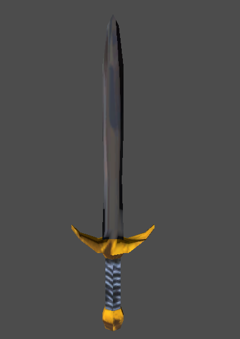

# Godot Old Roblox Mesh Utils
A extension for handling Old Roblox Mesh formats.

Currently supports Version 1.0 and 1.01.

## Example:


## Building

Run the following command:

```shell
git clone https://github.com/ThePlayerRolo/OldRobloxMeshUtils.git --recurse-submodules
cd OldRobloxMeshUtils
scons
```

## Usage:
The Roblox Mesh node is based on ArrayMesh, so all you need to do is add a .mesh file to your project and then use it as a standard ArrayMesh.